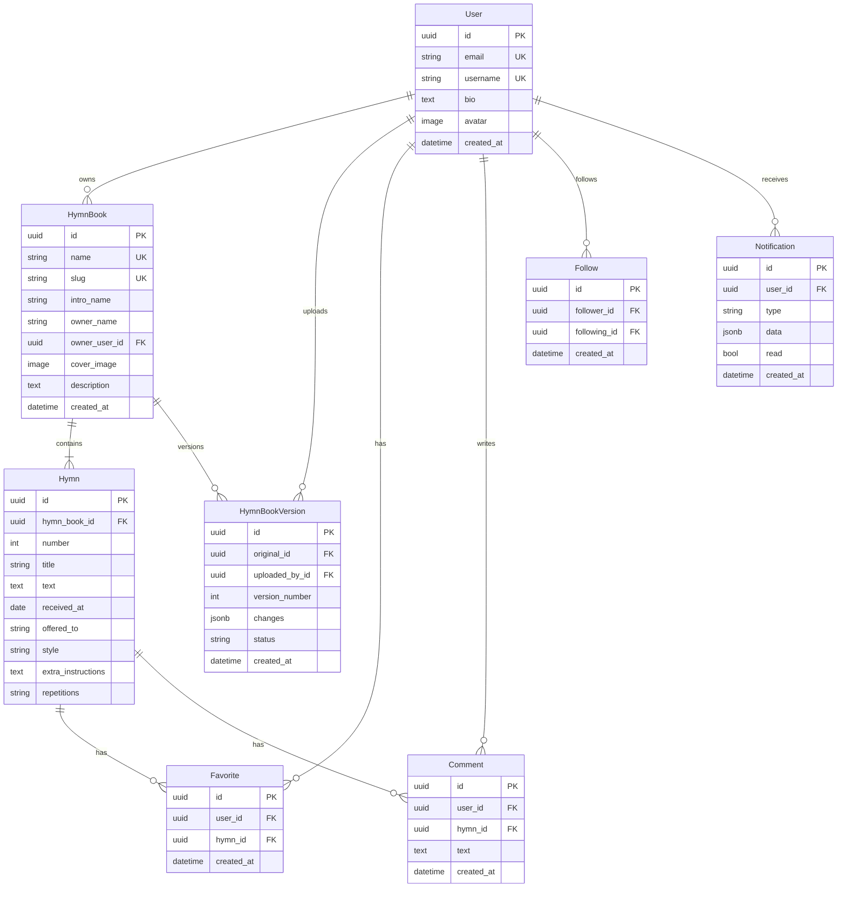

# Models e Schema

Documentação dos models do projeto.

## ERD (Entity Relationship Diagram)



## Models Detalhados

### HymnBook

```python
class HymnBook(models.Model):
    """Hinário - coleção de hinos."""

    id = models.UUIDField(primary_key=True, default=uuid.uuid4)

    # Identificação
    name = models.CharField(max_length=255, unique=True, db_index=True)
    intro_name = models.CharField(max_length=100, blank=True)
    slug = models.SlugField(unique=True, max_length=255)

    # Proprietário
    owner_name = models.CharField(max_length=255)
    owner_user = models.ForeignKey(
        'users.User',
        on_delete=models.SET_NULL,
        null=True, blank=True,
        related_name='owned_hymnbooks'
    )

    # Mídia e descrição
    cover_image = models.ImageField(upload_to='hymn_covers/', blank=True)
    description = models.TextField(blank=True)

    # Timestamps
    created_at = models.DateTimeField(auto_now_add=True)
    updated_at = models.DateTimeField(auto_now=True)

    class Meta:
        ordering = ['name']
        indexes = [
            models.Index(fields=['name']),
            models.Index(fields=['owner_name']),
        ]
```

**Campos:**

| Campo | Tipo | Descrição |
|-------|------|-----------|
| `name` | CharField | Nome único do hinário |
| `slug` | SlugField | Auto-gerado de name |
| `intro_name` | CharField | Nome curto para exibição |
| `owner_name` | CharField | Texto livre - quem recebeu |
| `owner_user` | FK User | Usuário dono (opcional) |
| `cover_image` | ImageField | Capa do hinário |
| `description` | TextField | Descrição completa |

### Hymn

```python
class Hymn(models.Model):
    """Hino individual dentro de um hinário."""

    id = models.UUIDField(primary_key=True, default=uuid.uuid4)

    hymn_book = models.ForeignKey(
        HymnBook,
        on_delete=models.CASCADE,
        related_name='hymns'
    )

    # Identificação
    number = models.PositiveIntegerField()
    title = models.CharField(max_length=255, db_index=True)

    # Conteúdo
    text = models.TextField()

    # Metadados
    received_at = models.DateField(null=True, blank=True)
    offered_to = models.CharField(max_length=255, blank=True)
    style = models.CharField(max_length=50, blank=True)
    extra_instructions = models.TextField(blank=True)
    repetitions = models.CharField(max_length=100, blank=True)

    class Meta:
        ordering = ['hymn_book', 'number']
        unique_together = [['hymn_book', 'number']]
```

**Constraints:**

- `unique_together(hymn_book, number)` - Número único por hinário
- `CASCADE delete` - Deleta hinos quando hinário é deletado

### User (Custom)

```python
class User(AbstractUser):
    """Usuário customizado com campos extras."""

    id = models.UUIDField(primary_key=True, default=uuid.uuid4)
    bio = models.TextField(blank=True)
    avatar = models.ImageField(upload_to='avatars/', blank=True)
```

### HymnBookVersion

```python
class HymnBookVersion(models.Model):
    """Versão de um hinário para tracking de mudanças."""

    id = models.UUIDField(primary_key=True, default=uuid.uuid4)
    original = models.ForeignKey(HymnBook, on_delete=models.CASCADE)
    uploaded_by = models.ForeignKey(User, on_delete=models.SET_NULL)
    version_number = models.PositiveIntegerField()
    changes = models.JSONField(default=dict)
    status = models.CharField(max_length=20, choices=STATUS_CHOICES)
```

### Favorite

```python
class Favorite(models.Model):
    """Hino favoritado por usuário."""

    user = models.ForeignKey(User, on_delete=models.CASCADE)
    hymn = models.ForeignKey(Hymn, on_delete=models.CASCADE)
    created_at = models.DateTimeField(auto_now_add=True)

    class Meta:
        unique_together = [['user', 'hymn']]
```

### Comment

```python
class Comment(models.Model):
    """Comentário em um hino."""

    user = models.ForeignKey(User, on_delete=models.CASCADE)
    hymn = models.ForeignKey(Hymn, on_delete=models.CASCADE)
    text = models.TextField()
    created_at = models.DateTimeField(auto_now_add=True)
```

## TypeSense Schema

```python
HYMNS_SCHEMA = {
    'name': 'hymns',
    'fields': [
        {'name': 'id', 'type': 'string'},
        {'name': 'hymn_book_id', 'type': 'string'},
        {'name': 'hymn_book_name', 'type': 'string', 'facet': True},
        {'name': 'hymn_book_slug', 'type': 'string'},
        {'name': 'owner_name', 'type': 'string', 'facet': True},
        {'name': 'number', 'type': 'int32', 'sort': True},
        {'name': 'title', 'type': 'string'},
        {'name': 'text', 'type': 'string'},
        {'name': 'style', 'type': 'string', 'facet': True, 'optional': True},
    ],
    'default_sorting_field': 'number'
}
```

**Facets:** `hymn_book_name`, `owner_name`, `style`
**Sortable:** `number`
**Searchable:** `title`, `text`

## Migrations

Ver histórico em:

- `apps/hymns/migrations/`
- `apps/users/migrations/`
