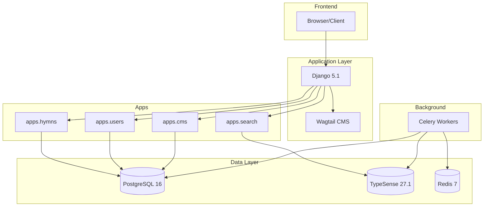
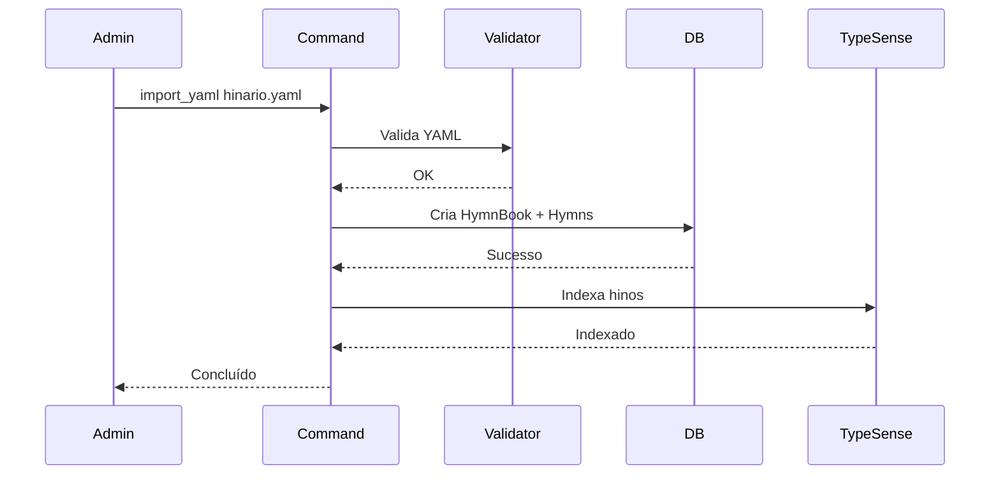
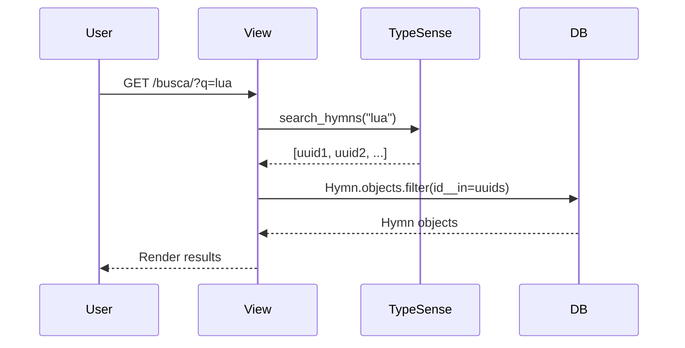
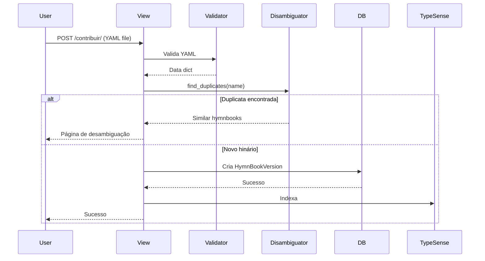

# Arquitetura do Sistema

## Visão Geral

O hyms-plat usa arquitetura monolítica Django com separação de apps por domínio.

## Diagrama de Arquitetura

## Apps Django

### `apps/hymns/` (Core)

**Responsabilidades:**

- Models: HymnBook, Hymn, HymnBookVersion
- Views: Home, List, Detail
- Admin: Interface de gerenciamento
- Commands: import_yaml

**Dependências:**

- `apps.search` - TypeSense integration
- `apps.users` - FK owner_user

### `apps/search/`

**Responsabilidades:**

- TypeSense client wrapper
- Index/reindex functions
- Search queries
- Commands: reindex_typesense

**Dependências:**

- `apps.hymns` - Hymn model

### `apps/users/`

**Responsabilidades:**

- Custom User model (bio, avatar)
- Upload e desambiguação
- Features sociais (favoritos, comentários, follows)
- Notificações

**Dependências:**

- django-allauth
- `apps.hymns`

### `apps/cms/`

**Responsabilidades:**

- Wagtail HomePage model
- CMS pages editáveis

**Dependências:**

- Wagtail

### `apps/core/`

**Responsabilidades:**

- Base mixins
- Common utilities
- Shared models

## Fluxo de Dados

### 1. Importação YAML → DB

### 2. Busca de Usuário

### 3. Upload de Hinário

## Padrões e Decisões

### UUID como Primary Key

**Por quê:** Melhor para sistemas distribuídos, não expõe contagem

**Trade-off:** Índices maiores que auto-increment

### TypeSense vs ElasticSearch

**Por quê:** TypeSense é mais simples, menor overhead, typo-tolerance nativo

**Trade-off:** Menos features avançadas que ElasticSearch

### Celery para Background Tasks

**Por quê:** Upload, reindexação são operações lentas

**Trade-off:** Mais complexidade operacional

### Wagtail CMS

**Por quê:** CMS Django-native para páginas editáveis

**Trade-off:** Overhead para features simples

Veja [Architecture Decisions](decisions.md) para detalhes.
