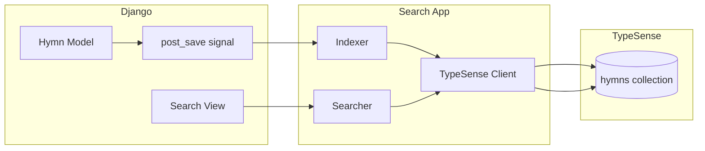

# Arquitetura de Busca

O projeto usa TypeSense como motor de busca principal.

## Por que TypeSense?

### Vantagens

| Feature | TypeSense | ElasticSearch |
|---------|-----------|---------------|
| Setup | Simples | Complexo |
| Typo-tolerance | Nativo | Plugin |
| Memória | ~500MB | ~2GB+ |
| Latência | <10ms | ~50ms |
| Manutenção | Baixa | Alta |

### Trade-offs

- Menos features avançadas que ElasticSearch
- Comunidade menor
- Menos integrações prontas

## Arquitetura



## Client TypeSense

### Configuração

```python
# apps/search/client.py
import typesense

client = typesense.Client({
    'nodes': [{
        'host': settings.TYPESENSE_HOST,
        'port': settings.TYPESENSE_PORT,
        'protocol': settings.TYPESENSE_PROTOCOL,
    }],
    'api_key': settings.TYPESENSE_API_KEY,
    'connection_timeout_seconds': 2
})
```

### Schema

```python
HYMNS_SCHEMA = {
    'name': 'hymns',
    'fields': [
        {'name': 'id', 'type': 'string'},
        {'name': 'hymn_book_id', 'type': 'string'},
        {'name': 'hymn_book_name', 'type': 'string', 'facet': True},
        {'name': 'hymn_book_slug', 'type': 'string'},
        {'name': 'owner_name', 'type': 'string', 'facet': True},
        {'name': 'number', 'type': 'int32', 'sort': True},
        {'name': 'title', 'type': 'string'},
        {'name': 'text', 'type': 'string'},
        {'name': 'style', 'type': 'string', 'facet': True, 'optional': True},
    ],
    'default_sorting_field': 'number'
}
```

## Indexação

### Indexar um Hino

```python
def index_hymn(hymn: Hymn) -> None:
    """Indexa um hino no TypeSense."""
    document = {
        'id': str(hymn.id),
        'hymn_book_id': str(hymn.hymn_book_id),
        'hymn_book_name': hymn.hymn_book.name,
        'hymn_book_slug': hymn.hymn_book.slug,
        'owner_name': hymn.hymn_book.owner_name,
        'number': hymn.number,
        'title': hymn.title,
        'text': hymn.text,
        'style': hymn.style or '',
    }

    client.collections['hymns'].documents.upsert(document)
```

### Via Signal

```python
@receiver(post_save, sender=Hymn)
def index_hymn_on_save(sender, instance, **kwargs):
    """Indexa automaticamente ao salvar."""
    index_hymn(instance)
```

### Reindexação Completa

```bash
poetry run python manage.py reindex_typesense
```

```python
# apps/search/management/commands/reindex_typesense.py
class Command(BaseCommand):
    def handle(self, *args, **options):
        # Deleta collection existente
        try:
            client.collections['hymns'].delete()
        except Exception:
            pass

        # Recria collection
        client.collections.create(HYMNS_SCHEMA)

        # Indexa todos os hinos
        for hymn in Hymn.objects.select_related('hymn_book'):
            index_hymn(hymn)
```

## Busca

### Função de Busca

```python
def search_hymns(query: str, per_page: int = 20, page: int = 1) -> dict:
    """Busca hinos no TypeSense."""
    search_parameters = {
        'q': query,
        'query_by': 'title,text,hymn_book_name,owner_name',
        'per_page': per_page,
        'page': page,
        'typo_tolerance': True,
    }

    return client.collections['hymns'].documents.search(search_parameters)
```

### Parâmetros de Busca

| Parâmetro | Descrição |
|-----------|-----------|
| `query_by` | Campos para buscar |
| `per_page` | Resultados por página |
| `typo_tolerance` | Tolerância a erros |
| `filter_by` | Filtros (facets) |
| `sort_by` | Ordenação |

### Exemplo com Filtros

```python
search_parameters = {
    'q': 'lua',
    'query_by': 'title,text',
    'filter_by': 'hymn_book_name:=O Cruzeiro',
    'sort_by': 'number:asc',
}
```

## View de Busca

```python
def search_view(request):
    query = request.GET.get('q', '')

    if not query or len(query) < 3:
        return render(request, 'search/search.html', {'results': []})

    # Busca no TypeSense
    response = search_hymns(query)

    # Busca objetos no Django (preservando ordem)
    hymn_ids = [hit['document']['id'] for hit in response['hits']]
    hymns = Hymn.objects.filter(id__in=hymn_ids)

    # Preserva ordem do TypeSense
    hymn_map = {str(h.id): h for h in hymns}
    ordered_hymns = [hymn_map[id] for id in hymn_ids if id in hymn_map]

    return render(request, 'search/search.html', {
        'results': ordered_hymns,
        'query': query,
        'total': response['found'],
    })
```

## Troubleshooting

### TypeSense não conecta

```bash
# Verificar container
docker ps | grep typesense

# Ver logs
docker logs typesense

# Testar conexão
curl http://localhost:8108/health
```

### Resultados desatualizados

```bash
# Reindexar
poetry run python manage.py reindex_typesense
```

### Busca lenta

- Verifique recursos do container TypeSense
- Use paginação adequada
- Limite campos em `query_by`
